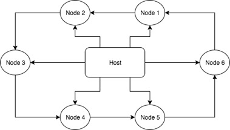
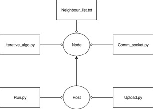

# Undergrad Thesis - Framework to Implement Iterative Algorithms on Distributed Systems

## Abstract
In this thesis, I build a framework for implementing iterative algorithms by abstracting the code for node communication. This thesis explains the building of said framework using a distributed algorithm and introduces the tools and methods used. I first implemented an algorithm and tested it out on a testbed of 15 Raspberry pi’s. After the desired functionality was met, I then went on to proceed with abstracting the code so that similar iterative algorithms could reuse the parts of the code that dealt with inter-node communication and communication link setup. This work is funded in part by the National Science Foundation

## Acknowledgments 
I would like to thank all those people who have provided their valuable time and generous help in helping me finish my senior thesis. My deepest gratitude is to my adviser, Prof. Nitin Vaidya. I have been fortunate to have an adviser who gave me constant guidance and resources during the entirety of my research experience. His elucidation of tough subject matter at different stages of my research helped me finish this thesis. I would specially like to thank my research partner, Jihui Yang, for his expertise and help. He was the ideal partner and helped me understand the convoluted aspects of socket programming with ease. I am deeply grateful to him for pushing me into trying out new aspects of programming; I am a significantly better programmer because of it. His company throughout the project was cherished and memorable. 

## Table of Contents
- [Introduction](#introduction)
- [Previous Work](#previous-work)
- [Implementation](#implementation)
  -- [Send/Receive.txt](#send/receive)
  -- [Comm_socket.py](#Comm_socket)
  -- [Iterative_algo.py](#iterative_algo)
  -- [Upload.py](#upload)
  -- [Run.py](#run)
  -- [Testbed](#Testbed)
- [Conclusion](#conclusion)  
- [Installation and Configuration](#installation-and-configuration)
- [References](#references)

## Introduction

In the research area of distributed systems, most of the time, algorithms are specifically developed to determine the behavior of a node - an independent unit that processes work - within a network of such nodes. These nodes are only aware of properties pertaining to itself and its neighbors. Each node has the ability to communicate with its neighbors through some form of message passing system (i.e. broadcast or unicast). Therefore, consider a set of interconnected nodes with some initial value such that after running the algorithm for several rounds, they all are left with the same value. Algorithms that execute certain blocks of code repeatedly are called iterative algorithms.  Also consensus is defined as when each node possessing an initial value, follows a distributed strategy to agree on the same value by calculating some function of these initial values. In this thesis we use iterative algorithms to obtain average consensus among the nodes. The purpose of this project is to build and study the behavior of these algorithms, such as those described in [\[1\]](#one)[\[2\]](#two)[\[3\]](#three)[\[4\]](#four)[\[5\]](#five).

The goal of the thesis was to quicken the setup of a network of nodes to study how an algorithm behaves. Often, valuable time is spent on setting up the testbed to run the algorithm on and also finding a means for communication between them. Cutting down on this time, we can help to get to the actual algorithm testing stage much quicker. This framework provides a way for the user to quicken development of such algorithms by abstracting the communication block of the code and testing the algorithm on a network of nodes by remotely uploading the data. 

We implement the program in Python for its general ease and use and abstraction. In the interest of speed and minimizing communication overhead, a shared memory approach was chosen to pass messages between the different threads that represented individual nodes. For the nodes themselves we use [Raspberry pi’s](https://www.raspberrypi.org/) with a 150 Mbps wireless USB network adapter [TL-WN727N](http://www.tp-link.com/us/download/TL-WN727N.html).

## Previous Work
In order to further improve the setup time of iterative algorithms, there has been quite a lot of work in the research community. A system [\[6\]](#six) to simulate a theoretical network of nodes to study how an algorithm behaves was developed. Real-world constraints like network delay and faulty nodes were not a concern for said project. Therefore, to be more real-world friendly we build upon this idea by configuring a testbed and testing different topological scenarios. As far as consensus (and average consensus) problems go, it has received extensive notice from the research community. The applicability to topics such as modeling of flocking behavior in biological, multi-agent systems, and physical systems [\[1\]](#one), [\[2\]](#two) makes it an extensively researched topic.  

## Implementation

In this thesis I implement the algorithm described in [\[5\]](#five) to test out the framework. As described in there, the algorithm helps to address the problem of achieving average consensus over lossy links. By average consensus, we mean to say that each node will end up with a value which is the average of the all the initial node values. By lossy links, we mean that communication channels between the nodes might be prone to packet loss. We achieve this lossy communication by using broadcast. In Figure 1, we can see the general topology of the testbed. The arrows represent the direction of communication; i.e. a recipient arrow means that a node can only receive information along those channels. Thus, we can see that every node can only send/receive information to/from one other adjacent neighbor node. Each node also receives data from the host. Thus, we simulate topological constraints through this cyclic nature of communication, thereby implementing a ring based routing system between the Raspberry pi’s using a neighbor list. 



Figure 2 shows the sub files present in each of the node and the host. We split up the implementation on the node side into 3 files. Neighbor_list.txt contains the neighbor list of each node. Comm_socket.py consists of the socket programming and node communication methods and finally Iterative_algo.py consists of the iterative algorithm we are implementing. On the host side, we have two files Upload.py uploads the files remotely to the nodes and compiles them inline. Run.py sends the start signal to begin the algorithm.



### Send/Receive.txt

These two files consists basis for the ring based routing algorithm to work. Essentially, these files govern which neighbors to talk to and which neighbors to listen to. In both the code samples below, we have the list for node with IP address 192.168.12.1. There is an oddity in the fact that the node itself appears in both categories, but this is due to the specificities of the algorithm [\[5\]](#five) we are implementing.
```
192.168.12.1
192.168.12.2
192.168.12.3
```

```
192.168.12.1
192.168.12.5
```
In our setup we utilize a ring based network topology. However, since we have a dedicated file to specify whom to receive/send from, in theory any network topology can be obtained by changing the corresponding IP addresses in this file. For example, if I want to recreate a bus topology we would use the host as the common line of communication between the nodes and each node can only send/receive from the host. 

### Comm_socket.py

This file contains most of the abstractions we have built in the framework. It can be imported in order to achieve broadcast communication between two nodes. All the user has to do is to call broadcastInit(port) and specify the IP address of the node he wants to send the information to. The file handles all the socket programming instructions such as opening, closing and specifying the type of transmission between sockets.

### Iterative_algo.py

This file consists of the bulk of the algorithm code to be implemented. This would be the file that the user modifies to implement the core functionality of the iterative steps in the algorithm. Figure 5 shows implementation of the algorithm stated in [\[5\]](#five).   broadcastReceive(port) is the function through which data is received by a node broadcastSend(port) is the function that calculates the new ‘node value’ by applying some function (i.e. average in our implementation ‘line 74&75’) on the initial values and transmits this value to other nodes. We also specify how many number of rounds the algorithm should run for in this function.

### Upload.py

While developing one of the major obstacles encountered was to update the recent version of the code on the different nodes in the network. This process can become very tedious indeed because manually removing the SD-card and updating the recent versions on the Raspberry pi’s is not the most optimized solution of doing it. Therefore Upload.py helps us to do this remotely from the host computer. Because Python does not need to compiled before it runs, we send an in-command line statement to run the file. Thereby this greatly reduces the development time and helps achieve quick code revisions on all nodes.

### Upload.py

While developing one of the major obstacles encountered was to update the recent version of the code on the different nodes in the network. This process can become very tedious indeed because manually removing the SD-card and updating the recent versions on the Raspberry pi’s is not the most optimized solution of doing it. Therefore Upload.py helps us to do this remotely from the host computer. Because Python does not need to compiled before it runs, we send an in-command line statement to run the file. Thereby this greatly reduces the development time and helps achieve quick code revisions on all nodes.

### Testbed

In Figure 8 we see the setup of the testbed. The white boxes are housings for the Raspberry Pi’s. They have a TpLink TL-WN727N network adapter attached via USB. For the purpose of user interface we have also connected keyboards and monitors. The rightmost node is always marked 1 and the convention observed is incrementation in the anticlockwise direction.

## Conclusion

During this thesis I learned about setting up an ad-hoc network. Then using this network configuration, I learned to send data packets between two computers using Unicast. I then extended the functionality to Broadcast. Using Broadcast, I implemented the average consensus algorithm to over lossy links. Once we got the algorithm to work between two computers, I expanded the testbed onto 15 Raspberry pi’s. Finally, in order to simulate topological constraints, I implemented a ring based routing algorithm in between the pi’s using a neighbor list. In order to make usability easier, a Python script was developed to remotely upload the files through broadcast onto the testbed. Then another script was run to simultaneously run the algorithm on the nodes. In the future, if given the opportunity, I would like to further extend the project by display the different statuses of the nodes on the main host computer. Also the nodes could return the data obtained through the iterations back to the host computer so that it would be easier for somebody to evaluate the test results. 

## References
1.<a name="one"></a>	Bernadette Charron-Bost, Matthias Függer, Thomas Nowak. Approximate Consensus in Highly Dynamic Networks: The Role of Averaging Algorithms, arXiv:1408.0620.

2.<a name="two"></a> John Duchi, Alekh Agarwal, Martin Wainwright. Dual Averaging for Distributed Optimization: Convergence Analysis and Network Scaling, arXiv:1005.2012.

3.<a name="three"></a> Lili Su, Nitin Vaidya. Fault-Tolerant Multi-Agent Optimization: Part III, arXiv:1509.01864.

4.<a name="four"></a> Lili Su, Nitin H. Vaidya. Fault-Tolerant Distributed Optimization (Part IV): Constrained Optimization with Arbitrary Directed Networks, arXiv:1511.01821.

5.<a name="five"></a> C. N. Hadjicostis, A. D. Dominguez-Garcia and N. H. Vaidya, "Resilient Average Consensus in the Presence of Heterogeneous Packet Dropping Links", Disc.ece.illinois.edu, 2012. [Online]. Available: http://disc.ece.illinois.edu/publications.php. [Accessed: 20- Apr- 2017].

6.<a name="six"></a>	S. Peter, "Undergrad Thesis - A system to simulate distributed algorithms (Java Application)", GitHub, 2016. [Online]. Available: https://github.com/speter52/GraphSim. [Accessed: 20- Apr- 2017].
